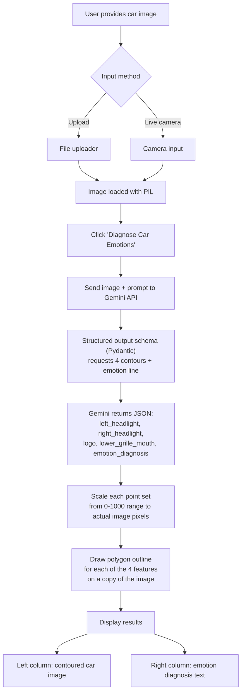

# Car eMotion 


## Basic Details
### Team Name: Audi Poyi


### Team Members
- Member 1: Vishnusree N

### Project Description
The project is a car empath which detects emotion of cars from their faces.

### The Problem (that doesn't exist)
Cars have feelings too. Humans need to be more empathetic.

### The Solution (that nobody asked for)
This application looks at the faces of cars, and translates what they feel.

## Technical Details
### Technologies/Components Used
For Software:
- Python 3.10
- Streamlit for UI
- Google GenAI API for the 
- PIL to save image and contour it
- pydantic to extract facial features


# Installation
```git clone https://github.com/vs-tries-to-code/useless_project_temp.git```
```pip install requirements.txt```


# Run
```streamlit run app.py```

### Project Documentation



# Screenshots (Add at least 3)

Uploading car image


Emotion diagnosis


# Video
https://drive.google.com/file/d/1gstqzja9aatf7R7SEqk35XQFGAGbT02r/view?usp=drive_link
Video demonstrates the working of emotion diagnosis


## Team Contributions
Vishnusree - Idea
Google Gemini - its implementation


---
Made with ❤️ at TinkerHub Useless Projects 


